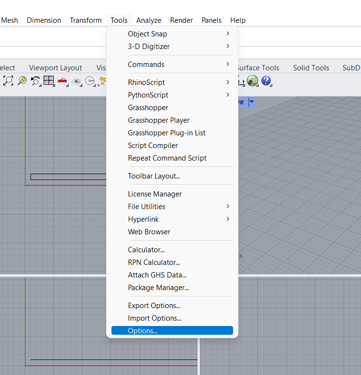
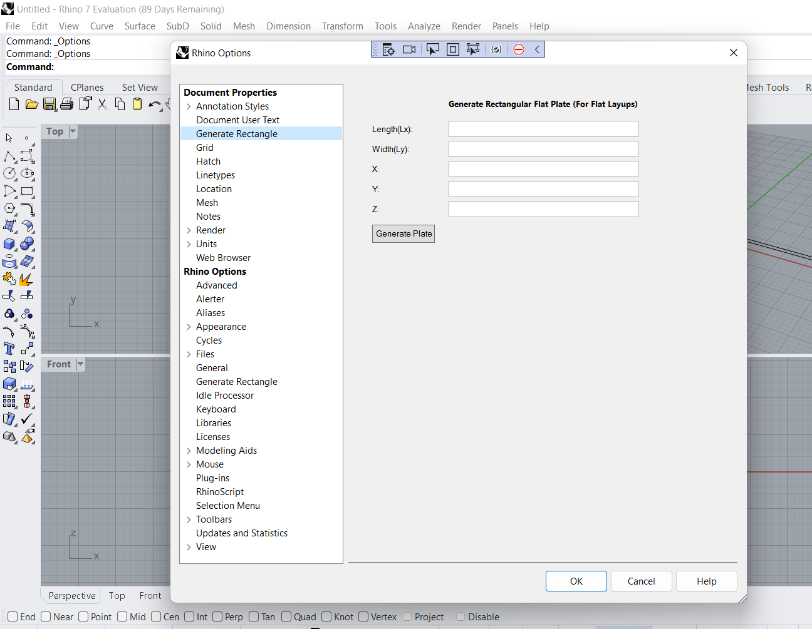
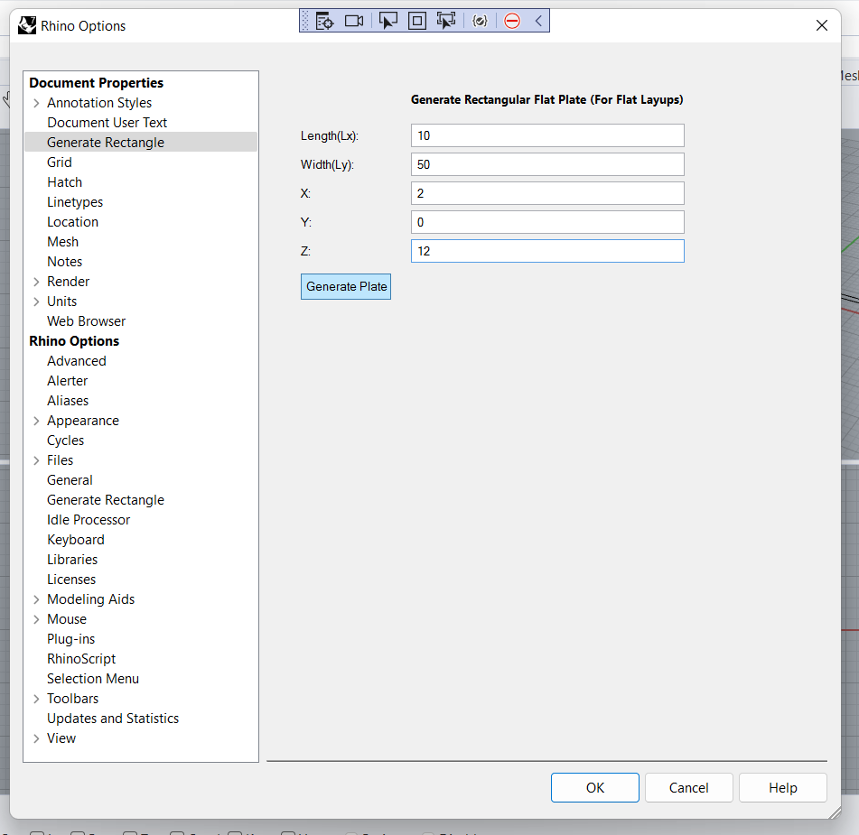
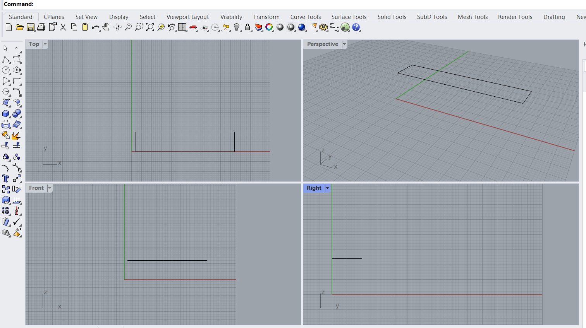

# RhinoPlugin
This is a Simple Rhino Plugin that interacts with Rhino Apis and gives the user ability to create rectangle based on the input provided.

<h1>Intsalling the Plugin</h1>

When you compile the main code in visual studio a .rhp file is created.

In the Rhino command prompt type the PlugInManager command. Click the Install… button.

Give the file location of your .rhp file in bin folder and click on Ok, your plugin is now installed

<h1>Using the Plugin </h1>
<h3>1.Go to tools->Options</h3>E:\codes\vstudio\repos\Cpp_games\TestingEto\TestingEto\assets\image.png

<h3>2.In the Options window ,Click on Generate Rectangle</h3>

<h3>3.Fill the values and click on generate</h3>

<h3>4.Your Rectangle is now Generated</h3>

<h1>Thankyou</h1>
